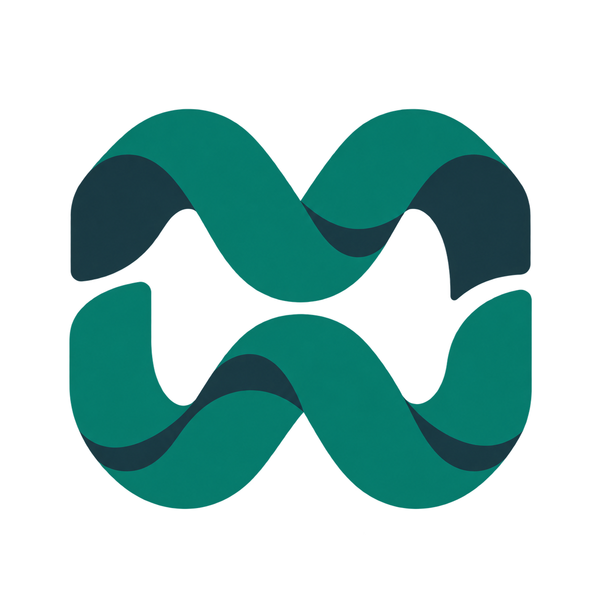
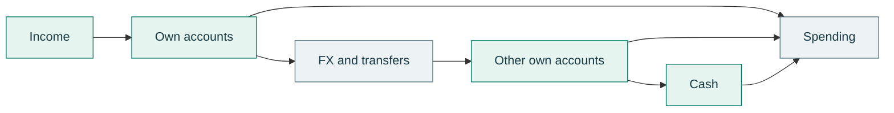

<p align="center">
  
</p>

<h1 align="center">MoneyWave</h1>

<p align="center">
  <strong>Know where your money went.</strong><br>
  Accounts, cash, spending and the cost of moving money.<br>
  An open-source finance workspace that runs on your Mac.
</p>

<p align="center">
  <a href="LICENSE"></a>
  
  
  
</p>

<p align="center">
  <a href="#inside-moneywave">Explore the workspace</a> ·
  <a href="#supported-sources">Supported sources</a> ·
  <a href="#run-locally">Run locally</a> ·
  <a href="#contribute">Contribute</a>
</p>

<p align="center">
  <a href="https://ko-fi.com/deus42"></a>
</p>

---

## Follow the money

Money gets complicated when it crosses accounts, currencies and cash. A transfer appears twice. A withdrawal looks like spending. Currency conversion makes costs harder to see. A spreadsheet slowly becomes a second job.

MoneyWave brings supported bank statements into a shared ledger, connects movements when the evidence supports them, and builds a monthly picture of your finances. You can trace the records behind a total and keep corrections without rewriting the originals.

A typical flow it helps explain:



> [!NOTE]
> **Personal project, shared openly.** MoneyWave grew out of one person's finances. The current release is for developers comfortable with macOS and local setup. Some categories, source formats and operator scripts remain specific to that workflow. General-purpose onboarding and automatic bank sync are still deferred.

## Inside MoneyWave

Six chapters share one reporting period, so you can move from the big picture to an individual operation without losing your place.

| Chapter | What you can see and do |
| --- | --- |
| **Overview** | Inspect known capital, income, spending, taxes, bank costs and savings differences. Open the records behind the numbers. |
| **Budget** | Compare spending with category limits, set bounded budget periods and compare years. |
| **Trips & events** | Group payments around a trip or event, track its budget and retain historical context. |
| **Purchases** | Connect payments, refunds and item details to large purchases. Archive and restore them. |
| **Operations** | Inspect expenses, correct categories and descriptions, split supported payments and undo edits. |
| **Cash** | Record daily cash expenses and inspect balances and trends in EUR, USD and UAH. |

The workspace also includes amount masking, coverage indicators and a browser print view that follows the selected period. Captured crypto positions contribute where dated evidence supports them; incomplete asset coverage stays visible.

### The accounting rules matter

- **Count each movement once.** Transfers between your accounts, owner draws and cash withdrawals remain movements rather than becoming additional income or spending.
- **Keep the evidence.** Original files stay immutable. Normalized records, links and reversible corrections retain their provenance.
- **Show the gaps.** Missing balances, rates and counterparties remain unknown. An unexplained difference never quietly becomes a fee.
- **Separate costs.** Statement fees, confirmed costs and estimated FX spread remain distinguishable.
- **Keep your corrections.** Compatible category edits, budgets and payment links survive an explicit report refresh; conflicts stop the affected operation.

## Supported sources

These are adapters for specific export formats. Bank names below do not imply a live connection or support for every export variant.

| Source | Current import scope |
| --- | --- |
| **PrivatBank** | Personal statement and FOP payment-journal formats. |
| **monobank** | Supported personal-account statement exports. |
| **Erste / George** | Supported EUR CSV statements. |
| **Wise** | Supported EUR XLSX statements, with explicit account binding. |
| **Revolut** | Supported EUR current-account CSV statements, with explicit account binding; nonzero-fee rows are not yet supported. |
| **Manual positions** | Monthly observations from a specific Savings XLSX layout, with cell-level provenance. |
| **Crypto** | Explicitly captured NEAR/Ethereum observations and supported historical evidence; no automatic wallet sync. |

The financial core retains native amounts and materializes UAH, EUR and USD valuations from cached official ECB/NBU rates. The current report website displays EUR.

## Run locally

**Prerequisites:** macOS, Node.js **24**, pnpm **11.16.0**, and Xcode Command Line Tools for the native dependencies and Swift Keychain helper.

```sh
git clone https://github.com/deus42/moneywave.git
cd moneywave

# Use Node 24; .nvmrc is included for nvm users.
pnpm install --frozen-lockfile
pnpm verify
```

`pnpm verify` runs lint, type checking, synthetic tests and repository security checks.

> [!IMPORTANT]
> **The website requires an initialized workspace.** A fresh checkout does not include a database, recovery key, bank statements or report. First-run setup is not packaged into a general-purpose wizard. The existing initialization and recovery services are described in the [architecture](docs/architecture.md); [data handling](data/README.md) documents the local storage boundary.

With your Keychain-backed database and report already initialized:

```sh
pnpm start
```

Open **[localhost:43821](http://127.0.0.1:43821/)**. Page reads use saved data; import and report refresh are explicit operations.

<details>
<summary><strong>Operator commands and private mobile access</strong></summary>

| Command | Purpose |
| --- | --- |
| `pnpm keychain:build` | Build the local Swift Keychain helper. |
| `pnpm workspace:seed <local-report.json>` | Validate and initialize a report; `--refresh` updates it while retaining compatible edits. Requires the existing encrypted store. |
| `pnpm import:manual-positions <local.xlsx>` | Preview a supported manual-position workbook; `--commit` enables the protected import. |
| `pnpm verify:real-data` | Run opt-in local checks with safe result codes. |
| `pnpm analyze:finance` / `pnpm analyze:privatebank` | Run **mutating** import and derivation operators with backup checks. These may invoke configured rate and categorization flows. |
| `pnpm stage:deploy` / `pnpm stage:status` / `pnpm stage:rollback` | Manage the maintainer's private container deployment. |

For private file paths, invoke the corresponding script directly to avoid package-manager argument echoes. Keep database and recovery keys out of arguments and environment variables.

The optional Tailscale deployment provides owner-only mobile access through an online Mac. Its database remains on macOS, with the key in Keychain. This deployment is specific to the maintainer's environment; see the [staging runbook](docs/staging.md) before adapting it. Preserve existing Tailscale mappings and verify recoverable backups before bulk writes.

</details>

## Built for private records

- **Encrypted storage:** SQLCipher, macOS Keychain and recovery support.
- **Local workspace:** loopback HTTP, local application assets, session and CSRF protection.
- **Controlled network access:** application requests are restricted to reviewed destinations. Opening a report does not contact a bank or refresh market prices.
- **Private inputs:** statements, databases, reports and backups stay in ignored local storage.

Optional expense categorization uses an existing Codex/ChatGPT sign-in and sends only a bounded, sanitized merchant label plus allowed category codes. It excludes raw statements, amounts, dates, account identifiers and balances. AI does not match transfers, choose FX rates or calculate costs. Details: [privacy and architecture](docs/architecture.md).

The processing core is independent of the website: **TypeScript · Node 24 · SQLCipher · native HTTP · HTML/CSS/JavaScript**. Money uses exact minor units and deterministic decimal calculations.

## Contribute

Focused fixes, synthetic reproductions and improvements to supported adapters are welcome. For a new bank, finance domain or external integration, open an issue to agree on scope first.

1. Read the [product specification](docs/specification.md) and [contributor instructions](AGENTS.md).
2. Describe the intended behavior and acceptance criteria before changing application code.
3. Add appropriate synthetic coverage, run `pnpm verify`, and keep the change focused.

**Keep real financial records out of issues, pull requests and screenshots.** Use invented examples to reproduce a problem.

| Read next | What's there |
| --- | --- |
| [Product specification](docs/specification.md) | Current behavior, acceptance criteria and deferred capabilities. |
| [Requirements](docs/requirements.md) | The financial questions MoneyWave is intended to answer. |
| [Architecture](docs/architecture.md) | Processing, storage, privacy and recovery boundaries. |
| [Decisions](docs/decisions.md) | The reasoning behind the current system. |
| [Category policy](docs/category-rules.md) | Classification rules and preservation of confirmed meaning. |

## Buy the next coffee

MoneyWave is built and maintained by [Oleksii Gapchenko](https://github.com/deus42). If it helps you understand your finances, or gives you useful code to build on, you can support its continued development.

<p align="center">
  <a href="https://ko-fi.com/deus42"></a>
</p>

Support is voluntary. Development follows the maintainer's own needs and available time.

---

[MIT License](LICENSE) · Copyright © 2026 Oleksii Gapchenko. Third-party dependencies retain their respective licenses.
